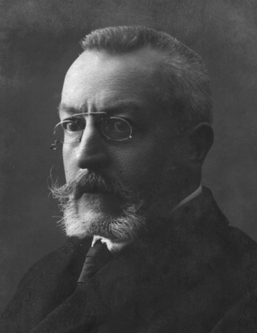

[[BOOKS]] #books #author #history
# Henri Pirenne
Verviers, 23 Dezember 1862 - Ukkel, 25 Oktober 1935
Belgischer Historiker, Rektor und Buchautor

[wikipedia](https://en.wikipedia.org/wiki/Henri_Pirenne)

## Bücher
[Mahomet et Charlemagne](2106032344.md)
Europa im Mittelalter
Stadt und Handel im Mittelalter
Geschichte Begiens
